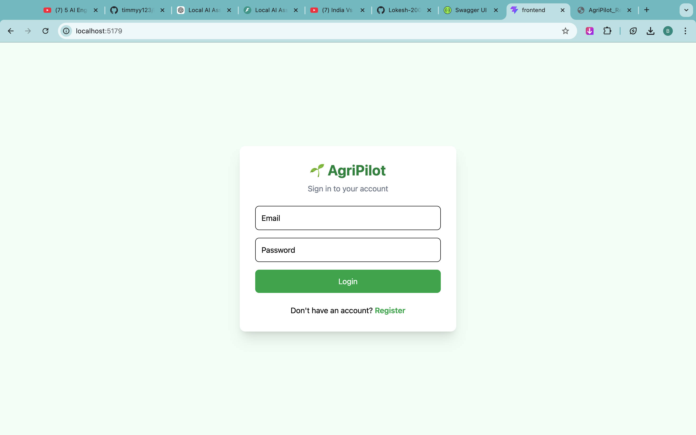
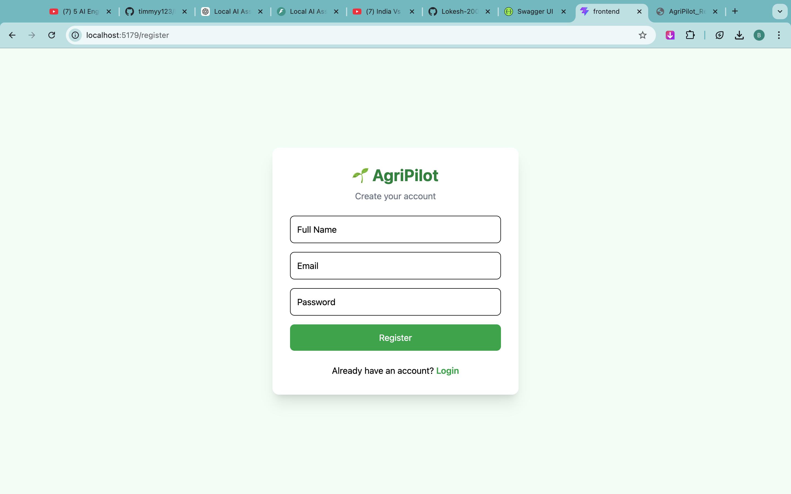
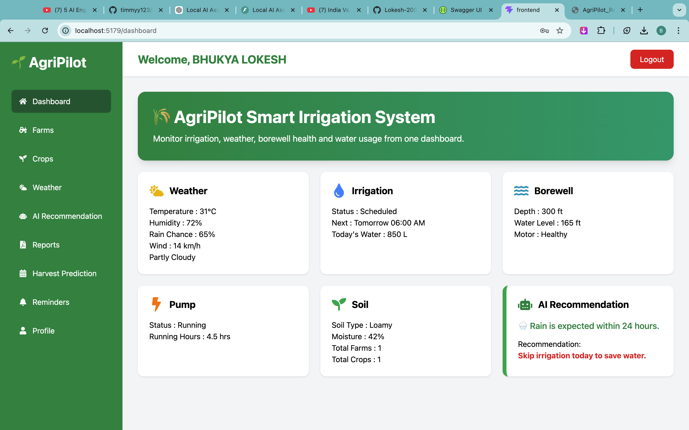
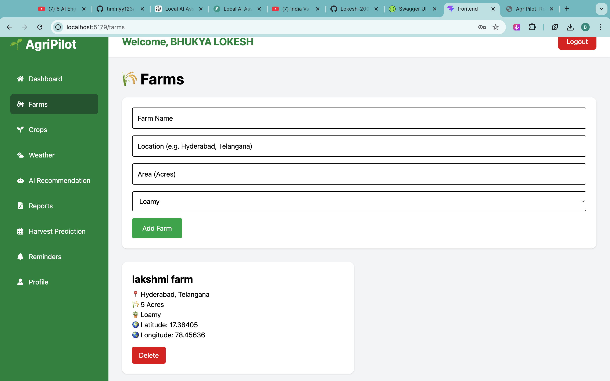
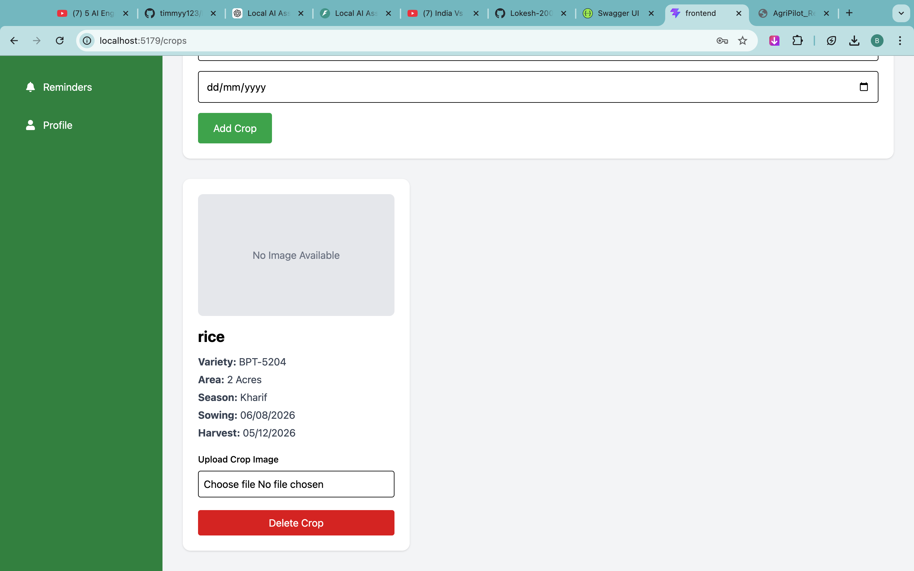
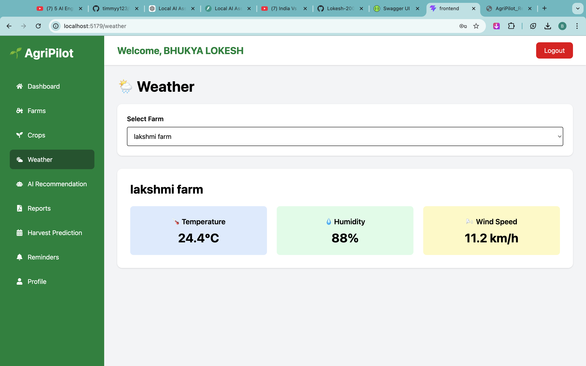
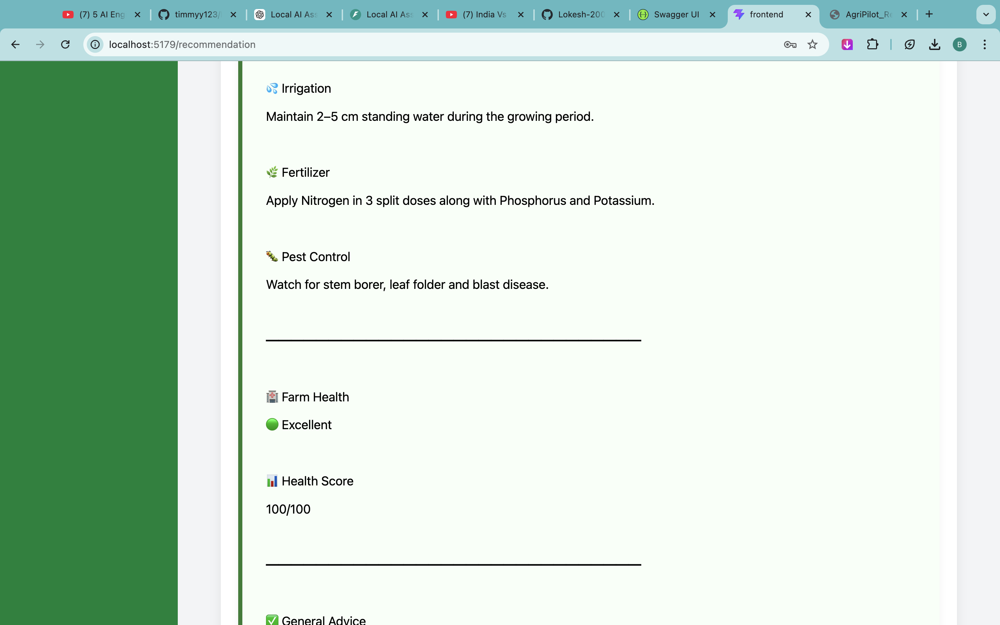
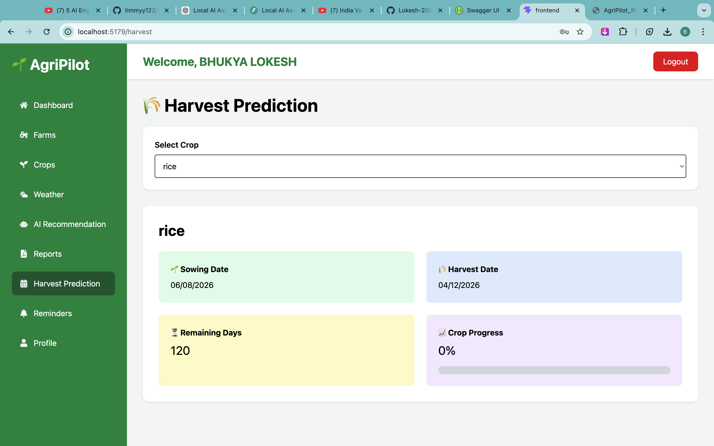
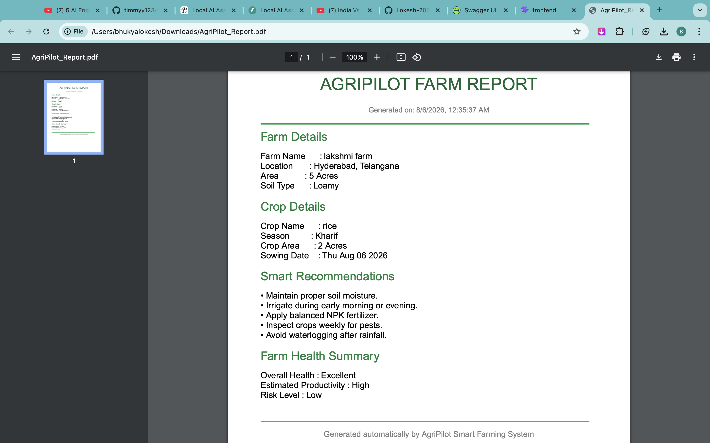
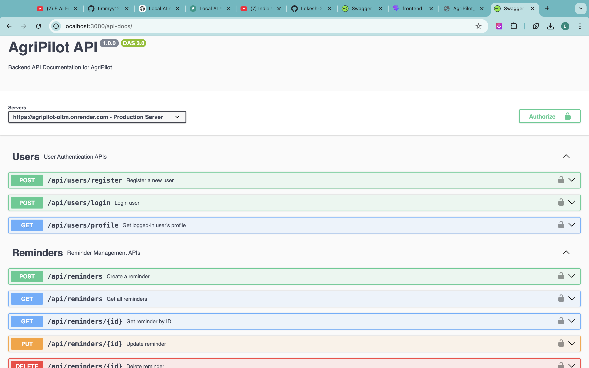

# 🌾 AgriPilot - Smart Farming Management System

A full-stack MERN web application that helps farmers efficiently manage farms, crops, weather, reminders, AI-based recommendations, harvest prediction, and downloadable PDF reports.

---

## 📌 Features

- 🔐 JWT Authentication
- 🌾 Farm Management
- 🌱 Crop Management
- 🌤 Weather Dashboard
- 🤖 AI Crop Recommendation (Rule-Based)
- 📈 Harvest Prediction
- 📄 PDF Report Generation
- ⏰ Reminder Management
- 📊 Dashboard Analytics & Charts
- 📚 Swagger API Documentation

---

## 🛠 Tech Stack

### Frontend

- React.js
- Vite
- Tailwind CSS
- Axios
- React Router
- Recharts

### Backend

- Node.js
- Express.js
- MongoDB
- Mongoose
- JWT
- PDFKit
- Swagger UI

---

## 📂 Folder Structure

```
AgriPilot
│
├── backend
│   ├── controllers
│   ├── middleware
│   ├── models
│   ├── routes
│   ├── uploads
│   └── server.js
│
├── frontend
│   ├── src
│   ├── components
│   ├── pages
│   ├── layouts
│   └── services
│
├── screenshots
│
└── README.md
```

---

## 🚀 Installation

### Clone Repository

```bash
git clone https://github.com/Lokesh-2005/AgriPilot.git
```

### Backend

```bash
cd backend
npm install
npm run dev
```

### Frontend

```bash
cd frontend
npm install
npm run dev
```

---

## 📸 Screenshots

### Login



---

### Register



---

### Dashboard



---

### Farms



---

### Crops



---

### Weather



---

### AI Recommendation



---

### Harvest Prediction



---

### Reports



---

### Swagger API



---

## 📖 API Documentation

After starting the backend:

```
http://localhost:3000/api-docs
```

---

## 🔮 Future Enhancements

- Live Weather API Integration
- AI/ML Crop Recommendation
- Disease Detection using Images
- Smart Irrigation Scheduling
- SMS Notifications
- Mobile Application

---

## 👨‍💻 Author

**Bhukya Lokesh**

B.Tech Chemical Engineering

Indian Institute of Technology Madras

---

## 📄 License

Developed for educational purposes.